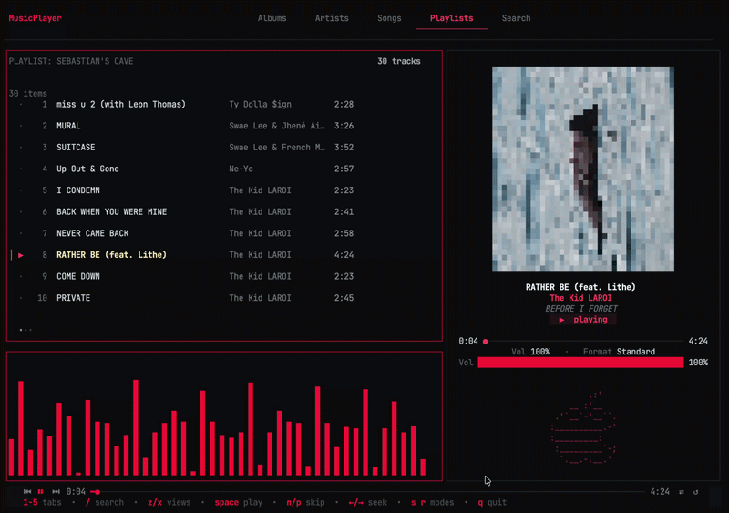

# 🎵 Apple Music TUI

> **⚠️ Work in Progress** — This project is actively under development. Features may be incomplete, unstable, or subject to change.

A terminal-based Apple Music player for macOS, built with Go. Control your Apple Music library directly from the command line with a slick, keyboard-driven TUI.


<div align="center">
  
</div>

## ✨ Features

- 🎧 **Now Playing panel** — album art rendered in the terminal using Unicode block characters
- 📚 **Full library browsing** — Songs, Albums, Artists, and Playlists tabs
- 🔍 **Search** — fuzzy search across your entire Apple Music library
- 📊 **Equalizer visualizer** — animated bar visualizer that reacts to playback
- ⌨️ **Keyboard-driven** — no mouse needed, fully navigable with hotkeys
- 🍎 **Apple ASCII art** — decorative Apple logo always visible in the player panel
- 🔀 **Shuffle & repeat** — toggle shuffle/repeat modes from the keyboard
- 🔊 **Volume control** — adjust volume inline

<br/>

## 📋 Requirements

- **macOS** (required — uses AppleScript to communicate with Apple Music)
- **Apple Music** app installed and running
- **Go 1.24+**
- A terminal with **true color** support (iTerm2, Warp, Kitty, etc.)

<br/>

## 🚀 Getting Started

### Clone & Build

```bash
git clone <repo-url>
cd SR-Player

go build -o musicplayer .
./musicplayer
```

### Run without building

```bash
go run .
```

<br/>

## ⌨️ Keybindings

| Key | Action |
|-----|--------|
| `1` | Albums tab |
| `2` | Artists tab |
| `3` | Songs tab |
| `4` | Playlists tab |
| `5` / `/` | Search |
| `Space` | Play / Pause |
| `n` | Next track |
| `p` | Previous track |
| `s` | Toggle shuffle |
| `r` | Toggle repeat |
| `←` / `→` | Seek backward / forward |
| `z` | Now Playing view |
| `x` | Queue view |
| `[` / `]` | Previous / Next tab |
| `↑` / `↓` | Navigate list |
| `Enter` | Select item |
| `q` | Quit |

---

## 🗂️ Project Structure

```
SR-Player/
├── main.go                  # Entry point
├── assets/
│   └── am-ascii.txt         # Apple ASCII art
└── internal/
    ├── applescript/         # macOS AppleScript bridge (playback, library queries)
    ├── models/              # Shared data types (Track, Playlist, NowPlaying, etc.)
    └── ui/                  # TUI layout and rendering
        ├── app.go           # Main Bubble Tea model (Update loop)
        ├── topbar.go        # Navigation tabs + brand
        ├── statusbar.go     # Bottom status bar
        ├── layout.go        # Panel sizing
        └── panels/          # Individual UI panels
            ├── nowplaying.go
            ├── tracklist.go
            ├── playlists.go
            ├── search.go
            └── queue.go
```

<br/>

## 🛠️ Built With

| Library | Purpose |
|---------|---------|
| [Bubble Tea](https://github.com/charmbracelet/bubbletea) | TUI framework (Elm-like architecture) |
| [Lipgloss](https://github.com/charmbracelet/lipgloss) | Terminal styling & layout |
| [Bubbles](https://github.com/charmbracelet/bubbles) | Reusable TUI components |

<br/>

## 🚧 Next up:

- [ ] Queue editing (reorder / remove tracks)
- [ ] Lyrics view
- [ ] Playlist creation / management

<br/>

## 📄 License

MIT — see `LICENSE` for details.
